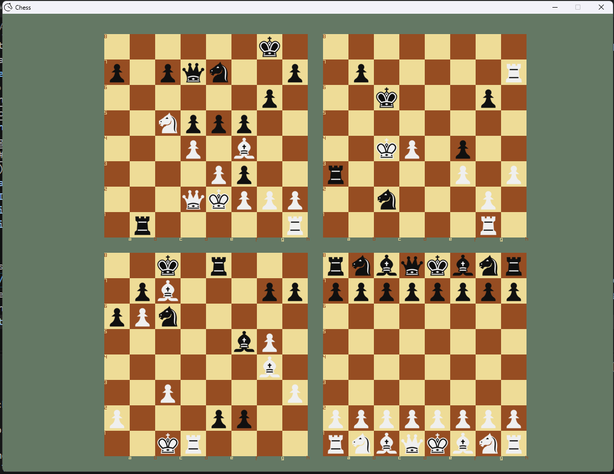

# Chess API

## Overview
This is a passion project sparked by [@Pineapple0Alex ](https://www.github.com/Pineapple0Alex). The goal is to create a full chess engine, meaning the front-end, back-end, and actual bot engines. Another aim of the project is to avoid AI-generated code as much as possible, and only use AI for assistance in understanding concepts and/or debugging.
## Table of Contents
- [Chess API](#chess-api)
  - [Overview](#overview)
  - [Table of Contents](#table-of-contents)
  - [Usage](#usage)
  - [Framework](#framework)
    - [GUI](#gui)
      - [ChessBoard](#chessboard)
        - [ChessBoard](#chessboard-1)
        - [setBoardSize](#setboardsize)
      - [ChessGUI](#chessgui)
    - [Chess Logic](#chess-logic)
      - [ChessLogic](#chesslogic)
    - [Chess Engines](#chess-engines)

## Usage
This porject is still currently under development. There may be issues. To run the code, run `./scripts/windows/run.sh` if on Windows, or alternatively `./scripts/linux/run.sh` if you are on Linux. This will compile without much hassle on Linux, but for Windows you need a `g++` compiler. Recommended is [MSYS2](https://www.msys2.org/) and use the `UCRT64` shell. You can use `pacman -Syu raylib`, although this shouldn't be necessary with the current compile method.

## Framework
### GUI
The GUI consists of [`ChessBoard`](#chessboard) instances that are rendered to the screen through the [`ChessGUI`](#chessgui). This allows for multiple instances of the [`ChessLogic`](#chesslogic) to be managed at once (a.k.a. play mulitple games of chess). 
#### ChessBoard
Literal structure:
```cpp
class ChessBoard
{
private:
    int _boardSize = 0;
    int _boardX;
    int _boardY;
    int _cellsPerRow;
    int _cellSize;
    int _boardFontSize;
    int _cursorPosition;
    ChessLogic* _internalChessLogic = nullptr;
    Texture2D   _pieceTextures[PIECE_TEXTURE_COUNT] = {};
    bitboard_t  _currentHighlightBitboard;

public:
    ChessBoard(ChessLogic* chessInstance, int boardX, int boardY, int boardSize);
    void setBoardSize(int size);
    void setBoardPostion(int x, int y);
    void setCurrentHighlightBitboard(bitboard_t bitboard){_currentHighlightBitboard = bitboard;};
    void boardSize(int size);
    void boardX(int x)               { _boardX         = x; };
    void boardY(int y)               { _boardY         = y; };
    void cellsPerRow(int cellsPerRow){ _cellsPerRow    = cellsPerRow; };
    void cellSize(int size)          { _cellSize       = size; };
    void boardFontSize(int fontSize) { _boardFontSize  = fontSize; };
    void cursorPosition(int position){ _cursorPosition = position; };
    Texture2D* pieceTextures() { return _pieceTextures; }
    int boardSize()      const { return _boardSize; };
    int boardX()         const { return _boardX; };
    int boardY()         const { return _boardY; };
    int cellsPerRow()    const { return _cellsPerRow; };
    int cellSize()       const { return _cellSize; };
    int boardFontSize()  const { return _boardFontSize; };
    int cursorPosition() const { return _cursorPosition; };
    ChessLogic* internalChessLogic() const { return _internalChessLogic; };
    const Texture2D* pieceTextures() const { return _pieceTextures; }
    bitboard_t currentHighlightBitboard() const { return _currentHighlightBitboard; }
    void initPieceTextures();
};
```
Individual methods:
##### ChessBoard
```cpp
ChessBoard(ChessLogic* chessInstance, int boardX, int boardY, int boardSize);
```
This is the constructor. It takes in a `ChessLogic*` which points to an instance of a chess game, the absolute `boardX` and `boardY` positions used for drawing the board, and the `boardSize` which determines how big the board is.
##### setBoardSize
```cpp
void setBoardSize(int size);
```
This method sets the board size with the passed parameter `size` and can be dynamically set throughout runtime.
#### ChessGUI
Literal structure:
```cpp
class ChessGUI
{
private:
    int _screenWidth;
    int _screenHeight;
    std::vector<ChessBoard*> _boards;
    bool _hasChange;
    RenderTexture2D _boardFrameCache;
public:
    ChessGUI(int screenWidth, int screenHeight);
    void initalize();
    Point getColumnAndRow(int index);
    void addBoard(ChessBoard& board);
    void handleInputs(ChessBoard& board);
    void handleMouse(ChessBoard& board);
    void renderBoard(ChessBoard& board);
    void renderPieces(ChessBoard& board);
    void renderBoardCache();
    void highlightCursor(ChessBoard& board);
    void hightlightCurrentBitboardCells(ChessBoard& board);
    void renderFileRankText(ChessBoard& board);
    void runGUI();
};
```
### Chess Logic
#### ChessLogic
Literal structure:
```cpp
class ChessLogic
{
public:
    bitboard_t occupiedBitboards[2] = {0};
    bitboard_t attackingSquares [2] = {0};
    static constexpr bitboard_t whitePawnPositions[64] = {...};
    static constexpr bitboard_t blackPawnPositions[64] = {...};
    static constexpr bitboard_t knightPositions[64]    = {...};
    static constexpr bitboard_t bishopPositions[64]    = {...};
    static constexpr bitboard_t rookPositions  [64]    = {...};
    static constexpr bitboard_t queenPositions [64]    = {...};
    static constexpr bitboard_t kingPositions  [64]    = {...};
    static constexpr piece_t playerPieceToPieceHash[16] = {...};
    static constexpr piece_t playerPieceToPlayerHash[16] = {...};
    static constexpr uint8_t playerPieceToTextureIndexHash [16] = {...};
    ChessLogic();
    bool currentPlayer;
    void calculateBlackPawnMoves();
    void loadFEN(std::string fenString);
    piece_t fenToPiece(char fenPiece);
    piece_t boardState[64] = {0};
    Point getFileAndRank(int index);
    int getIndex(Point pos);
    void generateBlackAndWhiteOccupiedBitboards();
    bitboard_t getPiecePositionBitboard(piece_t piece, int position);
    bitboard_t getLegalMovesBitboard(piece_t piece, int position);
};
```
### Chess Engines
TBD